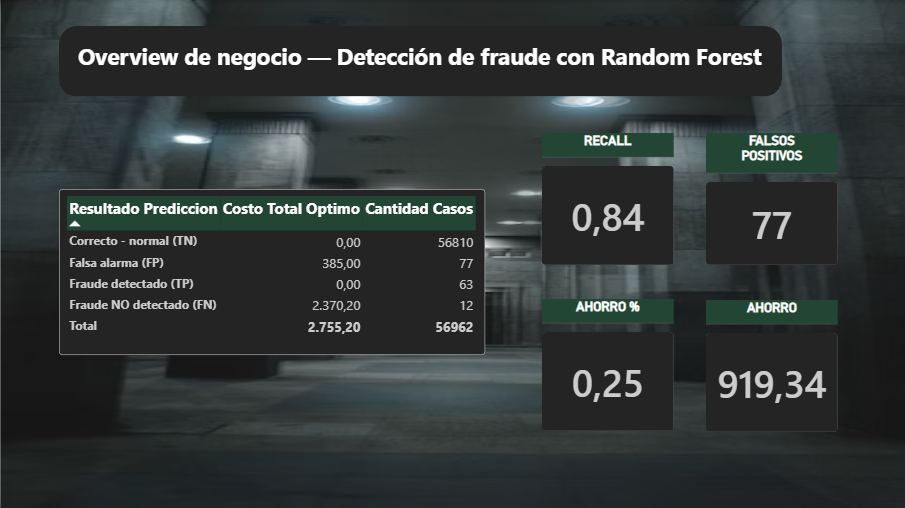
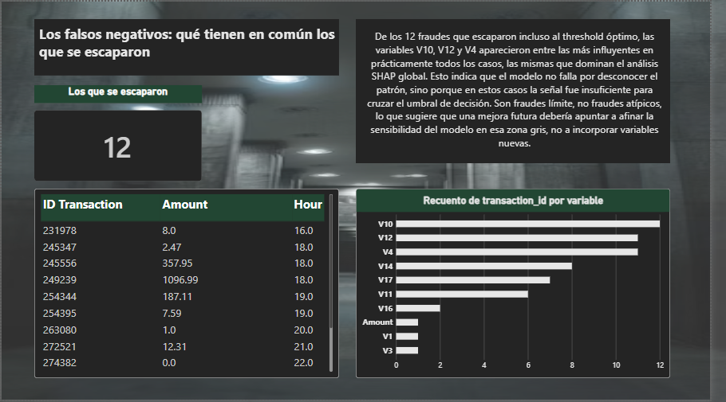

# Detección de fraude bancario con Machine Learning

Análisis de fraude en transacciones con tarjeta de crédito, enfocado en el costo de negocio detrás del modelo (no solo en las métricas técnicas), con explicabilidad vía SHAP, un módulo de traducción a lenguaje natural con LLM, y un dashboard interactivo en Power BI.

El dataset utilizado es público ([Credit Card Fraud Detection, Kaggle/ULB](https://www.kaggle.com/datasets/mlg-ulb/creditcardfraud)) y ha sido analizado cientos de veces. Este proyecto evita repetir el análisis estándar (distribución de montos, matriz de confusión, ROC-AUC) y se concentra en preguntas que rara vez se responden públicamente sobre este dataset: cuánto cuesta cada error para el negocio, si el threshold óptimo elegido es realmente confiable, qué casos se le escapan al mejor modelo posible, y si el patrón de fraude es estable en el tiempo.

## Tabla de contenidos

- [Motivación](#motivación)
- [Dataset](#dataset)
- [Metodología](#metodología)
- [Resultados](#resultados)
- [Hallazgos clave](#hallazgos-clave)
- [Dashboard interactivo en Power BI](#dashboard-interactivo-en-power-bi)
- [Módulo de explicabilidad (SHAP + LLM)](#módulo-de-explicabilidad-shap--llm)
- [Stack técnico](#stack-técnico)
- [Estructura del repositorio](#estructura-del-repositorio)
- [Cómo correr el proyecto](#cómo-correr-el-proyecto)
- [Próximos pasos](#próximos-pasos)
- [Autora](#autora)

## Motivación

La mayoría de los análisis públicos de este dataset se detienen en el desempeño del modelo (accuracy, ROC-AUC, matriz de confusión). Pero en un contexto real de banca, la pregunta que realmente importa es otra: **¿qué threshold de decisión minimiza el costo total para el negocio, y qué se pierde o se gana al moverlo?**

Este proyecto trata al modelo como un insumo de una decisión de negocio, no como el producto final. Además, documenta de forma transparente un error metodológico real (data leakage en la selección del threshold) y cómo se corrigió, algo que casi nunca se muestra en portfolios públicos.

## Dataset

- 284.807 transacciones de tarjetas de crédito europeas, realizadas en septiembre de 2013.
- 492 transacciones fraudulentas (0.173% del total), fuerte desbalanceo de clases.
- Variables `V1` a `V28`: componentes anonimizados vía PCA (sin significado de negocio explícito, por confidencialidad).
- `Time`: segundos transcurridos desde la primera transacción del dataset (ventana total de 2 días).
- `Amount`: monto de la transacción.
- `Class`: variable objetivo (1 = fraude, 0 = normal).

El archivo `creditcard.csv` no está versionado en este repositorio por su tamaño (150MB). Se descarga desde el link de Kaggle de arriba y se coloca en `data/creditcard.csv`.

## Metodología

1. **EDA**: distribución de clases, montos por clase, patrón horario del fraude.
2. **Split temporal (no aleatorio)**: 80% de transacciones más antiguas para entrenamiento, 20% más recientes para test, simulando un escenario realista de producción donde nunca se entrena con datos del futuro.
3. **Modelo**: Random Forest (`n_estimators=200`, `max_depth=10`, `class_weight='balanced'`), evitando SMOTE para no generar transacciones sintéticas sobre variables ya anonimizadas por PCA.
4. **Evaluación robusta a desbalanceo**: PR-AUC y ROC-AUC en lugar de accuracy.
5. **Optimización de threshold por costo de negocio**: en vez de usar 0.5 por defecto, se calcula el threshold que minimiza el costo total esperado (costo de un fraude no detectado = monto de la transacción, costo de una falsa alarma = costo fijo de revisión manual).
6. **Corrección de data leakage**: el primer threshold óptimo (0.33) fue calculado sobre el mismo test set usado para evaluar el modelo, lo cual es data leakage. Se corrige separando un set de validación exclusivo (dividiendo el set de entrenamiento en train/validation, manteniendo el orden temporal), seleccionando el threshold únicamente con el set de validación, y evaluando el resultado final una sola vez sobre el test set intacto.
7. **Explicabilidad con SHAP**: identificación de las variables que más influyen en cada predicción, caso por caso.
8. **Traducción a lenguaje natural**: un LLM (Qwen2.5-7B vía Hugging Face Inference API) convierte los valores SHAP de cada alerta en una explicación legible para un analista de riesgo no técnico.

## Resultados

| Métrica | Valor |
|---|---|
| PR-AUC | 0.81 |
| ROC-AUC | 0.99 |
| Threshold óptimo (con leakage, incorrecto) | 0.33 |
| Threshold óptimo (corregido, sin leakage) | 0.21 |
| Recall con threshold óptimo corregido | 84% |
| Precision con threshold óptimo corregido | 45% |
| Costo total con threshold 0.50 (default) | $1,998.08 |
| Costo total con threshold 0.21 (óptimo corregido) | $1,621.68 |
| Ahorro de costo | 18.8% ($376.40 sobre el período de test) |
| Falsos negativos con threshold óptimo | 12 de 75 fraudes reales en test |
| Falsos positivos con threshold óptimo | 77 |

*(Costos calculados sobre el período de test de 2 días. El costo de un falso negativo es el monto real de la transacción no detectada; el costo de un falso positivo es un costo fijo estimado de revisión manual de $5.)*

## Hallazgos clave

**El threshold por defecto (0.5) no tiene justificación de negocio.** Ajustarlo al costo real de cada tipo de error reduce el costo total esperado en 18.8%, sin modificar el modelo ni agregar datos.

**El primer threshold óptimo calculado (0.33) estaba sobreajustado.** Se había seleccionado evaluando sobre el mismo test set con el que luego se medía el modelo, una forma de data leakage. Al corregirlo con un set de validación exclusivo, el valor real resultó ser 0.21, con una diferencia de 0.12 puntos respecto a la estimación original. Esto confirma que la primera estimación estaba parcialmente sobreajustada al ruido de una muestra chica (75 casos positivos en test).

**El modelo óptimo sigue sin detectar 12 de los 75 fraudes del test set.** El análisis SHAP de estos 12 casos muestra que las variables que más los caracterizan (V10, V12, V4) son las mismas que dominan el análisis SHAP global del modelo. Esto sugiere que el modelo no falla por desconocer el patrón de fraude, sino porque en estos casos la señal fue insuficiente para cruzar el umbral de decisión: son fraudes límite, no fraudes atípicos.

**La tasa de fraude no es estable ni dentro de una ventana de 2 días.** Cae de 0.183% en el período de entrenamiento a 0.132% en el período de test (reducción relativa del 28%), con picos irregulares a lo largo del tiempo. Esto confirma que un split aleatorio habría ocultado esta deriva temporal (data drift), generando métricas artificialmente optimistas, y refuerza la necesidad de reentrenar modelos de fraude con frecuencia en un despliegue real.

## Dashboard interactivo en Power BI

Para complementar el análisis técnico, se construyó un dashboard en Power BI enfocado en comunicar estos hallazgos a una audiencia de negocio, con un control interactivo para explorar el trade-off entre falsos positivos y falsos negativos en tiempo real.

**Páginas del dashboard:**

1. **Overview de negocio**: KPIs de ahorro, recall y falsos positivos, con una matriz de costo en dólares (no solo conteos).
2. **Corrección de leakage**: comparación visual entre el threshold con bug (0.33) y el corregido (0.21).
3. **Threshold interactivo**: control deslizante que recalcula en vivo el costo total, falsos negativos y falsos positivos según el punto de decisión elegido.
4. **Los que se escaparon**: perfil de los 12 falsos negativos, con las variables SHAP que más influyeron en cada caso.
5. **Drift temporal**: evolución de la tasa de fraude a lo largo de las 48 horas del dataset, marcando el punto de corte entre train y test.

### Vista general



### Casos no detectados




El archivo `.pbix` está disponible en `powerbi/fraude_bank.pbix`. Los datos que consume se generan desde `notebooks/01_eda.ipynb` (celda de exports al final del notebook) y se guardan en `data/powerbi/`.

## Módulo de explicabilidad (SHAP + LLM)

Los valores SHAP son interpretables para un data scientist, pero no para un analista de riesgo sin formación técnica en ML. Se incorporó un módulo que traduce el output de SHAP de cada alerta a una explicación en lenguaje natural, usando un LLM (Qwen2.5-7B vía Hugging Face Inference API), cerrando la brecha entre el modelo y el usuario final del sistema. Este módulo requiere una API key de Hugging Face (`HF_TOKEN`) configurada en un archivo `.env` local, y es opcional para reproducir el resto del análisis.

## Stack técnico

- **Python**: pandas, scikit-learn, SHAP, matplotlib, seaborn
- **Machine Learning**: Random Forest (`scikit-learn`)
- **Explicabilidad**: SHAP (TreeExplainer)
- **LLM**: Qwen2.5-7B-Instruct (Hugging Face Inference API)
- **Visualización de negocio**: Power BI

## Estructura del repositorio

```
fraud-detection-bank/
├── data/
│   ├── creditcard.csv          # No versionado, descargar de Kaggle
│   └── powerbi/                 # CSVs exportados para el dashboard
├── notebooks/
│   └── 01_eda.ipynb             # Análisis completo: EDA, modelo, threshold, SHAP, LLM, exports
├── powerbi/
│   └── fraude_bank.pbix         # Dashboard interactivo
├── src/
│   └── fraud_model.pkl          # Modelo entrenado serializado
├── requirements.txt
└── README.md
```

## Cómo correr el proyecto

1. Cloná el repositorio y creá un entorno virtual.
2. Instalá las dependencias: `pip install -r requirements.txt`
3. Descargá `creditcard.csv` desde [Kaggle](https://www.kaggle.com/datasets/mlg-ulb/creditcardfraud) y colocalo en `data/creditcard.csv`.
4. (Opcional) Si querés correr el módulo de explicabilidad con LLM, creá un archivo `.env` en la raíz del proyecto con `HF_TOKEN=tu_token_de_huggingface`.
5. Ejecutá `notebooks/01_eda.ipynb` de punta a punta. La última celda exporta los datos necesarios para el dashboard a `data/powerbi/`.
6. Abrí `powerbi/fraude_bank.pbix` en Power BI Desktop para explorar el dashboard interactivo.

## Próximos pasos

- Incorporar una segunda capa de defensa (reglas de negocio) para los casos "límite" que el modelo actualmente no detecta.
- Evaluar la sensibilidad del modelo específicamente en la zona gris identificada en el análisis SHAP de falsos negativos.
- Simular el impacto de reentrenar el modelo con mayor frecuencia, dado el drift temporal observado incluso en una ventana de 2 días.
- Publicar el dashboard en Power BI Service para acceso interactivo sin necesidad de Power BI Desktop.

## Autora

Daniela Andrea Triador — Análisis de datos y Power BI
[https://dtriador.github.io/DTriador/](https://dtriador.github.io/DTriador/)